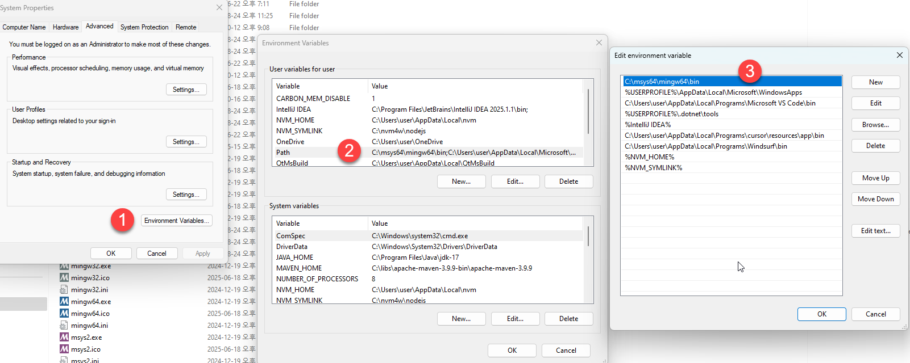
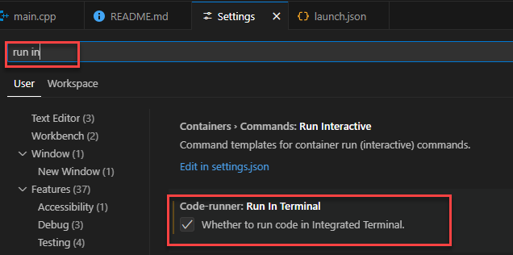

# Exercising c++ on Windows os using vsCode

[코테용 C++ 핵심 정리](https://www.youtube.com/watch?v=uDq7woPOZ_A)

[ref MinGW (Minimalist GNU Windows) w64 vis MSYS2 설치](https://github.com/niXman/mingw-builds-binaries)



> 1. Extension 설치
>    가. C/C++ Microsoft
>    나. Code Runner


> 2. C/C++ Edito configuration
>    (vscode > Command Palette..> C/C++ Edit Configuration (UI))
```bash
  "compilerPath": "C:/msys64/mingw64/bin/g++.exe",
  "cStandard": "c17",
  "cppStandard": "c++17",
  "intelliSenseMode": "windows-gcc-x86"
  > .vscode/c_cpp_properties.json 생성
```

> 3. Task 설정
```bash
# main.cpp 소스연 상태에서
1. (vsCode) Run > Run without Debugging (Ctr + F5)
    C++(GDB/LLDB)
    C++:g++.exe build and debug active file preLaunchTask
> .vscode/tasks.json 생성
```

> 4. .vscode/Launch.json (Debug)설정
```bash
1. (vscode) > Command Palette..> C/C++ Add Debug Configuration
    C++:g++.exe build and debug active file preLaunchTask
```

> Project 구조
```
cppOnVsCodeEx
|-.vsdoe
|   |- c_cpp_properties.json
|   |- launch.json
|   |- tasks.json
|   |-
|   |-
|- bin
|   |- main.exe
|   |-
|- include
|   |- bitManipulationEx.h
|   |- datatypesEx.h
|   |- enumEx.h
|   |- preProcessEx.h
|   |- utils.h
|   |- ....
|- obj
|   |- main.obj
|   |- ....
|- src
|   |- bitManipulationEx.cpp
|   |- datatypesEx.cpp
|   |- enumEx.cpp
|   |- main.cpp
|   |- preProcessEx.cpp
|   |- utils.cpp
|   |- ....
|- Makefile
|- README.md

```

> 5. Make file 생성
> 6. console에서 make 실행

```bash
user@ProBook440 UCRT64 /c/Users/user/Desktop/dev/cExUsingVsCode/cppOnVsCodeEx
$ make
```